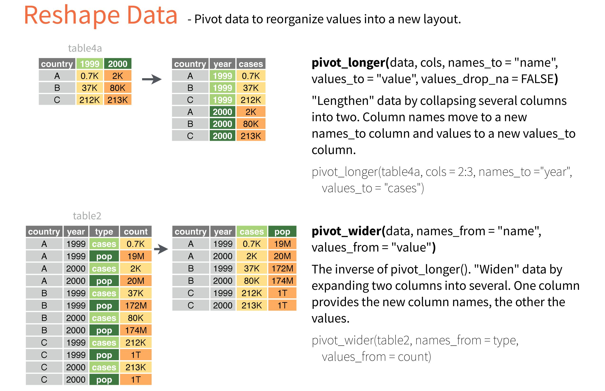

```{r setup, include=FALSE}
knitr::opts_chunk$set(echo = TRUE)
suppressPackageStartupMessages({
  library(dplyr)
  library(tidyr)
  library(ggplot2)
})
```

## Motivation

> Data scientists, according to interviews and expert estimates, spend from 50 percent to 80 percent of their time mired in the mundane labor of collecting and preparing data, before it can be explored for useful information.  

This tutorial covers selected *basics topics* of data handling based on the `tidyr` package. 

* General data handling \& processing
* Simple `ggplot2` plots (long format required)

Usage for transforming data from wide(r) to long(er) formats and vice versa:
* Eurostat: data in long format, wide format often required for regression analysis 
* Panel data analysis 

--- 

## Wide(r) format
* For **cross sections**, row corresponds to `i-th` individual (person, firm, etc.) and each column corresponds to a variable (age, height, weight). 

* For **time series**, row corresponds to a time period (year, quarter, day, etc.) and each column corresponds to a variable (GDP per capita, Unemployment rate). 

* Wide format is used in many `R`-based applications: linear regression, VAR models, etc.


## Long(er) format
* For **cross sections**, data is stretched so that a single individual may occupy multiple rows.
* The same applies to **time series**

--- 

## Syntax overview

## `pivot_longer()` and `pivot_wider()` commands

+ `pivot_longer()` converts wider format to longer
+ `pivot_wider()` converts longer format to wider



---


## GDP & Time Series Example  (single-variable example)

### GDP - Wider format

```{r}
GDPwide <- data.frame(
  Year = c(2009:2018),
  GER = c(411,723,325,456,579,612,709,513,527,379),
  FRA = c(123,300,400,500,600,654,789,906,413,567),
  USA = c(957,1000,569,896,956,1345,780,599,1023,678)
)
GDPwide # artifical/made-up data used here
```
--- 

* Above is the **wider format** - GDP data are shown for different states and years  

* In **longer format** (below), the same data are shown, yet each `Year` and `Country` combination is on a separate row of the dataset. 

    + Columns `Year`, `State` and `GDP` are used to display the same data as in wider format.  
    
    + Note that `State` and `GDP` *variables* (i.e. columns in the longer-format dataset) need to be created to produce the longer format (such *variables* do not exist in the wider format dataset)

### GDP - Longer format (same data)

```{r, echo=F}
GDPlong <- pivot_longer(GDPwide, cols = 2:4, names_to = "State", values_to = "GDP")
print(as.data.frame(GDPlong))
```


--- 

### Task 1: Convert `GDPwide` to longer format

```{r,echo=T}
GDPwide # repeated from above for readability
```

`pivot_longer(GDPwide, cols = 2:4, names_to = "State", values_to = "GDP")`

* `GDPwide` dataframe to reshape - convert to longer format 

* `cols = 2:4` numeric indexes of columns *to collapse* into a single column. 


* `names_to = "State"` is the name of the new *key* column - a new *variable* (can be any character string you supply). Values in the "State" column are based on column names of the columns being collapsed (`2:4`).  
    + *variable*-names in the wider format dataframe (State IDs: `GER`,`FRA`,`USA`) are used as "entries" (keys) in the new column (hence variable name `State`).  

* `values_to = "GDP"` name of the new value column (can be any character string you supply)  

* Please note that column `Year` (1st column) is left out from the syntax ("grey column" as in the illustration above).  


```{r}
GDPlong <- pivot_longer(GDPwide, cols = 2:4, names_to = "State", values_to = "GDP")
print.data.frame(GDPlong)
```

---

### Task 2: Convert `GDPlong` to wider format 

`pivot_wider(GDPlong, names_from = "State", values_from = "GDP")`

* `GDPlong` dataframe to reshape - convert to wider format
* `names_from = "State"` column to use for keys (new column names, i.e. new *variable names*)
* `values_from = "GDP"` column to extract values from (will enter into data-cells in the new (wider) dataframe)
* Please note that column `Year` is left out from the syntax ("grey column" as in the illustration above).

```{r}
GDPwide_2 <- pivot_wider(GDPlong, names_from = "State", values_from = "GDP")
print.data.frame(GDPwide_2)
```

* Columns in `GDPwide_2` can be ordered alphabetically, using the `names_sort = T` argument.

---

* A *transposed* output can be produced as follows


```{r}
pivot_wider(GDPlong, names_from = "Year", values_from = "GDP")
```

* However, this type of data frame formatting is seldom useful.

--- 


#### Data in longer format can be used for plotting by `{ggplot2}`.

```{r}
# In this example, we plot GDP only,
# so go back to the GDPlong dataset
Plot1 <- ggplot(data = GDPlong, aes(x = Year, y = GDP))+
  geom_line(aes(color=State))+
  xlab("Year")+ylab("Artificial GDP data")+
  facet_grid(State~.)
Plot1

Plot2 <- ggplot(data = GDPlong, aes(x = Year, y = GDP))+
  geom_line(aes(color=State))+
  xlab("Year")+ylab("Artificial GDP data")+
  theme_light() # remove faceting, include theme "light"
Plot2
```

---

## Supervised work - Excercise 1

The following wide-format dataset contains GDP per capita for Spain (source: Eurostat)

* Euro per inhabitant in percentage of the EU average (100 = EU's average in a given year)
* 2005 - 2016 data
* Measured at the [NUTS2 level](https://en.wikipedia.org/wiki/NUTS_statistical_regions_of_Spain)


```{r}
GDPSpain <- read.csv("datasets/GDP_pc_Spain.csv")
head(GDPSpain[,1:8],12) # only columns 1 to 8 are shown
str(GDPSpain)
dim(GDPSpain)
``` 

1) Using the `pivot_longer()` command, convert `GDPSpain` to a long format & show output


```{r}
# uncomment the following line and comlete the command
# GDPSpain_L <- pivot_longer()
```


2) Use the `pivot_wider()` command to transform `GDPSpain_L` (longer format) back to the original wider format & show output

```{r}
# uncomment the following line and comlete the command
# GDPSpain_W2 <- pivot_wider()
```


3) Use `ggplot2` to plot the data (either use all NUTS2 regions or select any 4 regions)
    * show a graph with all series in one plot,
    * show a graph using facets.


---- 

## Multiple-variable example (can be used for panel data handling)

* Please note how `GDPlong` format in previous example resembles panel data analysis - both `id` and `time` identification is provided in each row. 

* However, with longer-format, we only have one value item in each row. The remaining columns (items in each row) provide identification to our observation. 

* Panel data format and *Long(er) format* are different: 
    * Following on our example, say, we want to store `GDP` and `Unemployment` in a long format. Here, the long format requires four columns: `Year`, `State`, `Unit` ("GDP","Unemployment"),`Value` (observed data). 


```{r}
GDPlong$Unit <- "GDP"
NewDF <- rbind(GDPlong,GDPlong)
colnames(NewDF) <- c("Year","State","Value","Unit")
NewDF$Unit[31:60] <- "Unemp"
set.seed(1)
NewDF$Value[31:60] <- rnorm(30,5,sd=0.2) # just random numbers around 5% unempl. level
NewDF <- NewDF %>% 
  arrange(Year,State,Unit) %>% 
  mutate(Value= round(Value,2)) %>% 
  select(State,Year,Unit,Value)
#
# Long format
# First two years, all the countries, both observed variables shown
# total number of rows: 60
head(as.data.frame(NewDF),12)
# Transform NewDF to wider format
Wider_NewDF <- pivot_wider(NewDF, names_from = "Unit", values_from = "Value")
head(as.data.frame(Wider_NewDF))
# Transform back to longer format
Longer_NewDF <- pivot_longer(Wider_NewDF, cols = 3:4, names_to="Unit", values_to="Value")
head(as.data.frame(Longer_NewDF),12)
# 
# Alternatively, for TS-based analysis, we can transform the dataset
# to have all entries for a given year in a single row:
TS_wider <- pivot_wider(NewDF, names_from = c(State,Unit), values_from = "Value")
head(as.data.frame(TS_wider))
```

---

## Supervised work - Excercise 2

The following long-format dataset contains unemployment data (in %) for Austria, Czechia, Poland, Slovakia (source: Eurostat)

* 2010 - 2020 data
* Information available for Male, Female & Total

```{r}
UnDF <- read.csv("datasets/UnExercise.csv")
head(UnDF,12) # only columns 1 to 8 are shown
str(UnDF)
dim(UnDF)
``` 

1) Using the `pivot_wider()` command, convert `UnDF` to a wider format & show output. You want panel-data like output, with M/F/T unemployment levels as new variables and corresponding ID information on each row.


```{r}
# 
```


2) Use the `pivot_longer()` command to transform the wider-format data back to the original longer format & show output

```{r}
# 
```

3) Using the `pivot_wider()` command, convert `UnDF` to a TS-type wide format & show output. You want TS-data output, with M/F/T unemployment levels in each country as new variables (e.g. "AT_F" for female unemployment in Austria).


```{r}
# 
```

---

## Final remarks

We have covered just a small section of the `tidyr` package and its functionality. 

For detailed discussion on the topic, you may have a look at: 

* [tidyr package](https://tidyr.tidyverse.org/index.html)  
* [pivot - wider/longer](https://tidyr.tidyverse.org/articles/pivot)  
* [cheatsheet](https://github.com/rstudio/cheatsheets/blob/main/tidyr.pdf)  


> Other/advanced data reshaping tools

`{tidyr}` provides sufficient functionality for many empirical tasks.

If necessary, additional control over reshaping data may be obtained through the `{reshape2}` package:

* `melt()` from `{reshape2}` expands the functionality of `pivot_longer()`
* `dcast()` from `{reshape2}` expands the functionality of `pivot_wider()` 


For additional information on `{reshape2}`, see:

+ [Tutorial by Timothy Carsel](https://ademos.people.uic.edu/Chapter8.html) 
+ [Tutorial by Sean C. Anderson](https://seananderson.ca/2013/10/19/reshape/) 
+ [reshape2 pdf](https://cran.r-project.org/web/packages/reshape2/reshape2.pdf) 
+ `R09_Eurostat_in_depth_data_handling.R` (in your `R` working directory for Block 1)  

---


