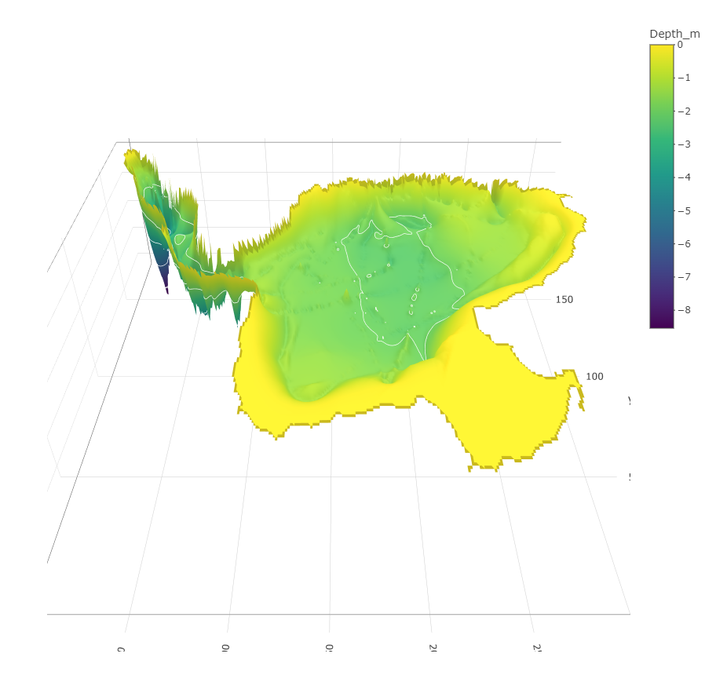

---

## Description and motivation

**Lake Rangsdorf - bathymetry**

* Using multiple depth measurements obtained for a given lake, we apply IDW to estimate bathymetric profile (lake floor depth profile).  
* To show the process of combining data from different sources: checking data quality, merging datasets, filtering `sf` objects.  
* Plotting the results.  


*General description of the Rangsdorf lake and its location:*  

* Lake Rangsdorf is located at the southern margin of the Teltow Plateau and a former proglacial drainage system, the Rangsdorf-Thyrow-Abflussbahn. Its basin has originally emerged as part of a subglacial drainage system, still visible at the panhandle Krumme Lanke and its northern continuation–the Glasow-Bach valley, whereas the main basin has been designed as a kettle hole. The northern part of Krumme Lanke still exhibits its basin shape as a glacial tunnel lake (max. lake depth 9 m with and average depth of roughly 3.5 m), where the southern main lake shows the typical morphology of a kettle lake silting up to an average depth of approx. 0.9 m (max. 2.7 m). As most of the other shallow lakes in Brandenburg, lake Rangsdorf is an eutrophic to hypertrophic lake suffering from heavy algae blooms in summer season.


```{r, echo=FALSE,message=FALSE,include=FALSE}
library(mapview)
library(sf)
library(dplyr)
```

--- 

## First, we read-in the three datasets

* **The first dataset is a map of the lake (shore-line):**

```{r,message=FALSE}
shoreline <- st_read('datasets/lake.gpkg')
str(shoreline)
st_crs(shoreline)$epsg # https://epsg.io/32633 coords in meters, dist. from "centerpoint"
plot(shoreline[,1])
```


* **Second dataset is a series of geo-coded sonar depth measurements**

```{r}
sonar <- st_read('datasets/sonar.gpkg')
str(sonar)
plot(sonar[,1])
```


* **Third dataset comes from geo-coded sediment-sampling records**

```{r}
sediments <- read.csv("datasets/Sediments.csv")
str(sediments)
#
sediments <- st_as_sf(sediments,
                      coords = c('x', 'y'), 
                      crs = 32633,
                      sf_column_name="geom") # to match remaining datasets
plot(sediments[,"depth_m"])
```

--- 

## Data visualization 

* Using the `{mapview}` package, the three datasets can be visualized on a map:

```{r}
mapview(shoreline, color = "red", highlight = F, label = 'Shoreline') + 
  mapview(sonar, color = 'black', highlight = F, label = 'Sonar', cex = 1) + 
  mapview(sediments, label = 'Sediment \ndata', cex = 4)
```


---- 

## Bathymetric profile

#### Suggested steps for calculating and ploting the lake floor profile:

--- 

#### (1) Check dataset compatibility

Note that `shoreline` object is a single polygon (line along the shore). However, you can safely assume that the depth at shore is zero and use the data for interpolation (zero-depth at shore assumption holds for our lake, potentially not in general).  

* `shoreline_points <- st_cast(x = shoreline, to = "POINT")`  

#### (2) Basic data cleaning and verfication

Are all geocodings compatible (EPSG-codes identical)? Are all measurements valid (say, "inside" the lake polygon)? Are there any NA depth measurements? Are there any sonar-based zero measurements? While shoreline zero-depth is OK, sonar-based zero measurements are errors (based on aditional device-related information).

* Spatial filtering: `st_filter(points,polygon) # measurements in lake?`  
* After removing NAs and sonar-based zeros, are the depth values OK, considering we aim for a 2D and 3D plot?  
* After some  filtering, `sf` datasets can be combined by `rbind(data1,data2,data3)`.

#### (3) Generate a target object for interpolation

* Start from a convenient rectangle, the bounding box: `st_bbox(polygon)`.  
* Convert the bounding bbox to a suitable sf object `st_as_sfc(bbox)`.  
* Make the grid using `st_make_grid(bbox_sf, cellsize = 10, what="centers")`.  
* Convert the grid into sf dataframe `st_as_sfc(grid)`.  
* Filter out all grid points that are not inside the lake.  

#### (4) IDW

* Functions and syntax available from previous examples


#### (5) Plot 2D and 3D graphs 

* Assuming IDW output is in the `lakeFloor$var1.pred` column, we can produce the following plots (as well as many other plots):  

**2D plots:**
```
# gstat-based plot
plot(lakeFloor[,"var1.pred"])
#
# terra-based raster plot
# Convert sf object to terra object
library(terra)
grid_vect <- terra::vect(lakeFloor)
# Create a raster template with the desired resolution
raster_template <- terra::rast(grid_vect, res = 10)
# Rasterize the grid
LakeRaster <- rasterize(grid_vect, raster_template, field = "var1.pred")
# plot the {terra} raster
plot(LakeRaster)
```

**3D plots (using plotly package):**
```
library(rayshader)
lakeRSDr <- rayshader::raster_to_matrix(LakeRaster)
library(plotly)
plot_ly(type = "surface",
        contours = list(z = list(show = TRUE, size = 1, start = 0, end = -8, color = 'white')),
        z = ~lakeRSDr) %>% 
  layout(
    scene = list(
      zaxis = list(nticks = 8),
      camera = list(eye = list(x = 0, y = -1, z = 0.8)),
      aspectratio = list(x = .9, y = .9, z = 0.3)))
```

---

The 3D plot may look like this:




--- 

* You can either amend and fill-in this `.Rmd` file, or you can use a separate `R script` file. 

To use plain R script, you can start by copy-pasting the following code into a new script file:

```
library(sf)
library(dplyr)
# reading in 3 datasets
shoreline <- st_read('datasets/lake.gpkg')
str(shoreline)
sonar <- st_read('datasets/sonar.gpkg')
str(sonar)
sediments <- read.csv("datasets/Sediments.csv")
sediments <- st_as_sf(sediments, 
                         coords = c('x', 'y'), 
                         crs = 32633,
                         sf_column_name="geom")
str(sediments)     
#
#
# creaging the target grid for interpolation
bbox <- st_bbox(shoreline)
bbox_sf <- st_as_sfc(bbox)
grid <- st_make_grid(bbox_sf, cellsize = 10, what = "centers")  # Adjust cellsize as needed
grid <-st_as_sf(grid)
grid <- st_filter(grid,shoreline)
plot(grid)
grid$depth_m <- NA
#
#
```

---

*Example amended from: Hartmann, K., Krois, J., Waske, B. (2018): E-Learning Project SOGA: Statistics and Geospatial Data Analysis. Department of Earth Sciences, Freie Universitaet Berlin.*
